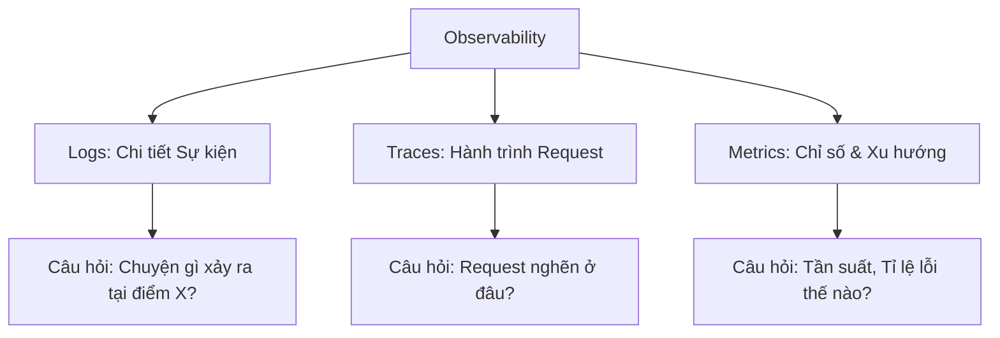
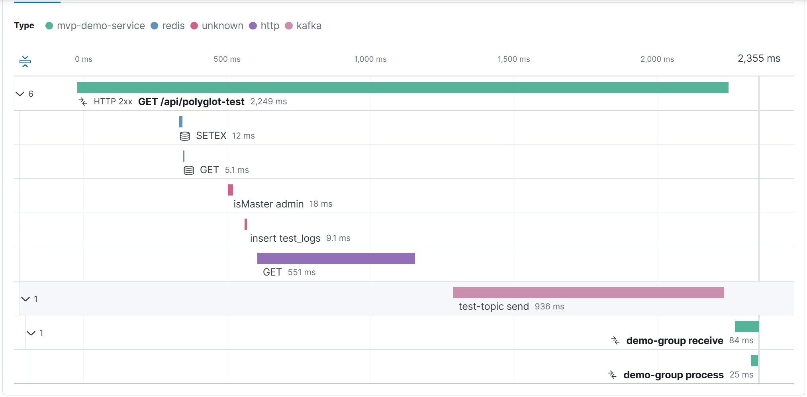

# 🔭 TIÊU CHUẨN QUAN SÁT HỆ THỐNG (OBSERVABILITY STANDARD)
### *Tài liệu hướng dẫn thực thi & vận hành dành cho Developer & System Architect (SA)*

---

## 📌 MỤC LỤC
1. [Giới thiệu & Triết lý Observability](#1-giới-thiệu--triết-lý-observability)
2. [Định nghĩa & So sánh 3 Trục Dữ liệu (Pillars of Observability)](#2-định-nghĩa--so-sánh-3-trục-dữ-liệu-pillars-of-observability)
3. [Tiêu chuẩn Logging (Nhật ký Sự kiện) - Đúng, Đủ và Không Rác](#3-tiêu-chuẩn-logging-nhật-ký-sự-kiện---đúng-đủ-và-không-rác)
4. [Tiêu chuẩn Tracing (Dấu vết Phân tán) - Bám sát luồng Request](#4-tiêu-chuẩn-tracing-dấu-vết-phân-tán---bám-sát-luồng-request)
5. [Tiêu chuẩn Metrics (Số liệu Đo lường) - Xu hướng & Trạng thái](#5-tiêu-chuẩn-metrics-số-liệu-đo-lường---xu-hướng--trạng-thái)
6. [Yêu cầu Thiết kế Dashboard & Các câu hỏi Vận hành cần giải quyết](#6-yêu-cầu-thiết-kế-dashboard--các-câu-hỏi-vận-hành-cần-giải-quyết)

---

## 1. Giới thiệu & Triết lý Observability

Trong các hệ thống phân tán và microservices hiện đại, giám sát theo kiểu truyền thống (Monitoring) chỉ trả lời câu hỏi: **"Hệ thống có đang hoạt động hay không?"** (thông qua ping, healthcheck). 

**Observability (Khả năng quan sát)** tiến xa hơn bằng cách trả lời câu hỏi: **"Tại sao hệ thống lại hoạt động như vậy?"**. Nó cho phép Developer và SA suy luận ra trạng thái bên trong của một hệ thống phức tạp dựa trên các đầu ra bên ngoài của nó mà không cần deploy code debug mới.

### Vai trò của tài liệu:
* **Đối với SA (System Architect):** Định hình kiến trúc dữ liệu giám sát, thiết kế hệ thống cảnh báo (alerting), hoạch định tài nguyên hệ thống và xây dựng quy chuẩn vận hành chung.
* **Đối với Dev (Developer):** Cung cấp tiêu chuẩn viết code, ghi log đúng định dạng, cấu hình đo lường hiệu năng và tích hợp trace context xuyên suốt các dịch vụ.

---

## 2. Định nghĩa & So sánh 3 Trục Dữ liệu (Pillars of Observability)

Một hệ thống có khả năng quan sát toàn diện phải được xây dựng dựa trên sự kết hợp hài hòa của **3 trục dữ liệu (Logs, Traces, Metrics)**. Mỗi trục giải quyết một góc nhìn khác nhau.



### Bảng so sánh 3 trục dữ liệu:

| Đặc tính | Logging (Logs) | Tracing (Traces) | Metrics (Metrics) |
| :--- | :--- | :--- | :--- |
| **Định nghĩa** | Bản ghi chi tiết của các sự kiện đơn lẻ kèm ngữ cảnh cụ thể. | Hành trình đi qua các component của một request cụ thể. | Dữ liệu dạng số được tổng hợp theo thời gian (Aggregated). |
| **Độ chi tiết** | Rất cao (Có thông tin biến, stack trace, chi tiết lỗi). | Trung bình đến Cao (Timeline, Dependency call, Latency). | Thấp (Chỉ gồm số lượng, tỉ lệ, xu hướng, phân vị). |
| **Chi phí lưu trữ** | Rất đắt (Dữ liệu dạng text dung lượng lớn, tăng tuyến tính). | Đắt (Cần kỹ thuật lấy mẫu - Sampling để tối ưu chi phí). | Rất rẻ (Dữ liệu số cực nhỏ gọn, thời gian lưu trữ lâu dài). |
| **Khả năng cảnh báo**| Kém (Chỉ nên cảnh báo khi xuất hiện lỗi nghiêm trọng cụ thể). | Trung bình (Cảnh báo dựa trên thời gian thực thi của span). | Rất tốt (Dễ cấu hình ngưỡng cảnh báo: CPU > 80%, Error > 1%). |
| **Mục đích chính** | Điều tra nguyên nhân sâu xa (Root Cause Analysis). | Phát hiện nút thắt cổ chai (Bottleneck) & lỗi luồng truyền dẫn. | Giám sát trạng thái sức khỏe tổng quan & dự báo tài nguyên. |

---

## 3. Tiêu chuẩn Logging (Nhật ký Sự kiện) - Đúng, Đủ và Không Rác

Logging là trục dữ liệu dễ bị lạm dụng nhất, dẫn đến hai trạng thái cực đoan: **"Mù thông tin"** (khi có sự cố không tìm được log) hoặc **"Ngập lụt log rác"** (tốn chi phí lưu trữ, làm chậm hệ thống và loãng thông tin điều tra).

### 3.1. Ghi Log có cấu trúc (Structured Logging) - Bắt buộc
Tuyệt đối **không** ghi log dưới dạng chuỗi văn bản thuần túy (Plain Text) ghép chuỗi. Định dạng xuất bản log bắt buộc phải là **JSON** để hệ thống tập trung dữ liệu (Elasticsearch, Loki) có thể phân tích cú pháp thành các trường dữ liệu tìm kiếm được.

*   ❌ **SAI (Ghép chuỗi hoặc nội suy string):**
    ```csharp
    // Elasticsearch chỉ hiểu đây là một chuỗi ngẫu nhiên, không thể tìm kiếm theo UserId hoặc OrderId
    _logger.LogInformation($"User {userId} processed order {orderId} in {elapsed}ms.");
    ```
*   ✔️ **ĐÚNG (Sử dụng Message Template):**
    ```csharp
    // Serilog sẽ bóc tách các biến thành các thuộc tính JSON: properties.UserId, properties.OrderId, properties.ElapsedMs
    _logger.LogInformation("User {UserId} processed order {OrderId} in {ElapsedMs}ms", userId, orderId, elapsed);
    ```

### 3.2. Tiêu chuẩn phân định Log Levels
Nhà phát triển phải tuân thủ nghiêm ngặt quy tắc sử dụng Log Level để tránh làm nhiễu hệ thống cảnh báo:

*   **FATAL (CRITICAL):**
    *   *Định nghĩa:* Lỗi hệ thống nghiêm trọng làm chết tiến trình (Crash) hoặc hư hỏng luồng nghiệp vụ cốt lõi không thể tự phục hồi (Hỏng kết nối DB chính, đứt kết nối Message Queue chính, cấu hình sai lúc start-up).
    *   *Hành động:* Kích hoạt SMS/Pager/Slack cảnh báo lập tức cho đội trực vận hành (On-call).
*   **ERROR:**
    *   *Định nghĩa:* Lỗi xảy ra trong phạm vi một Request hoặc một Task cụ thể, nhưng ứng dụng vẫn tiếp tục chạy được để phục vụ các Request khác (Lỗi nghiệp vụ ném ra Exception, lỗi gọi API bên thứ ba thất bại sau khi đã retry).
    *   *Hành động:* Ghi lại kèm Stack Trace. Đẩy lên Dashboard lỗi để Dev xử lý.
*   **WARNING (WARN):**
    *   *Định nghĩa:* Các tình huống bất thường hoặc tiềm ẩn nguy hiểm nhưng hệ thống vẫn tự động xử lý/bỏ qua được (Gọi API bị timeout nhưng retry lần 2 thành công, CPU chạm ngưỡng 80%, Request không hợp lệ từ phía Client - 4xx).
    *   *Hành động:* Theo dõi xu hướng. Nếu số lượng WARNING tăng đột biến, có thể hệ thống sắp gặp sự cố lớn.
*   **INFORMATION (INFO):**
    *   *Định nghĩa:* Ghi lại các cột mốc quan trọng của luồng nghiệp vụ (Ứng dụng khởi động thành công, Đơn hàng được thanh toán, Tiến trình Background bắt đầu chạy).
    *   *Hành động:* Lưu trữ để tra cứu lịch sử luồng đi (Audit/Lịch sử giao dịch).
*   **DEBUG:**
    *   *Định nghĩa:* Các thông tin kỹ thuật phục vụ quá trình phát triển (Giá trị biến số, các câu SQL được sinh ra, luồng nhánh rẽ logic).
    *   *Hành động:* **Chỉ bật ở môi trường Dev/Staging**. Phải cấu hình tự động tắt ở môi trường Production.
*   **TRACE:**
    *   *Định nghĩa:* Thông tin siêu chi tiết (Từng dòng code chạy qua, nội dung payload HTTP thô).
    *   *Hành động:* Luôn tắt trên mọi môi trường, ngoại trừ khi cần debug khẩn cấp trực tiếp.

### 3.3. Quy tắc vàng để Tránh "Log Rác" (Log Hygiene)
Để giữ cho hệ thống log luôn sạch sẽ, dễ tra cứu và tiết kiệm chi phí:

1.  **Nghiêm cấm log trong vòng lặp (Loop):**
    *   *Tình huống:* Xử lý danh sách 10.000 bản ghi.
    *   *Cách làm sai:* Ghi 1 dòng log `INFO` cho mỗi bản ghi được xử lý thành công. (Sinh ra 10.000 logs vô ích).
    *   *Cách làm đúng:* Chỉ log 1 dòng `INFO` tổng kết sau khi chạy xong vòng lặp: `Processed {SuccessCount}/{TotalCount} items. Failed: {FailedCount}`. Nếu có bản ghi lỗi, ghi log `WARN/ERROR` riêng cho bản ghi lỗi đó.
2.  **Không log trùng lặp (Redundant Logging / Exception Log Bloat):**
    *   *Tình huống:* Lỗi xảy ra ở tầng Repository, ném lên Service, ném tiếp lên Controller.
    *   *Cách làm sai:* Tầng nào cũng bắt exception, ghi log lỗi rồi lại `throw` tiếp lên. (Sinh ra 3 dòng log lỗi giống hệt nhau kèm stacktrace cồng kềnh cho cùng 1 lỗi).
    *   *Cách làm đúng:* Chỉ ghi log lỗi **duy nhất một lần** tại nơi xử lý exception cuối cùng (thường là Global Exception Middleware) hoặc tại nơi lỗi được xử lý triệt để (rẽ nhánh logic).
3.  **Tắt log mặc định của Thư viện bên thứ ba (Framework Logs):**
    *   Mặc định, các framework như ASP.NET Core, EF Core log rất nhiều thông tin dư thừa ở mức `INFO` (như kết nối DB, thời gian chạy query SQL, thông tin route).
    *   *Cấu hình bắt buộc:* Đè cấu hình tối thiểu (Override) cho các namespace framework lên mức `WARNING`:
        ```json
        "Logging": {
          "LogLevel": {
            "Default": "Information",
            "Microsoft": "Warning",
            "System": "Warning"
          }
        }
        ```
4.  **Hỗ trợ thay đổi Log Level động (Dynamic Log Level Changes):**
    *   Hệ thống phải hỗ trợ thay đổi log level mà không cần restart service (ví dụ: đổi từ `INFO` sang `DEBUG` trong 10 phút để bắt lỗi trên production rồi tự động chuyển lại). Có thể hiện thực qua API Endpoint bảo mật hoặc tính năng auto-reload file cấu hình.

### 3.4. Tiêu chuẩn Ghi Log "ĐỦ"
Một dòng log được coi là đủ thông tin phục vụ điều tra phải thỏa mãn:

*   **Bắt buộc có Context liên kết:** `TraceId`, `SpanId` (chuẩn OpenTelemetry) và `CorrelationId` (chuẩn liên kết request) để liên kết log với các trục dữ liệu khác.
*   **Có Metadata môi trường:** `Environment` (production, staging), `ServiceName`, `Version`.
*   **Log Exception đúng cách:**
    *   ❌ **SAI:** `_logger.LogError("Lỗi khi tạo đơn hàng: " + ex.Message);` (Mất sạch Stack Trace và các thuộc tính lỗi nội bộ).
    *   ✔️ **ĐÚNG:** `_logger.LogError(ex, "Failed to create order for customer {CustomerName}", customerName);` (Serilog tự động bóc tách Exception thành cấu trúc dữ liệu chi tiết).
*   **Mã hóa / Che mờ dữ liệu nhạy cảm (PII & Security):**
    *   Tuyệt đối không log thông tin nhạy cảm: Password, OTP, Số thẻ tín dụng, Access Token.
    *   Bắt buộc triển khai bộ lọc tự động che mờ (PII Masking Enricher) trước khi xuất log ra Console/File.

---

## 4. Tiêu chuẩn Tracing (Dấu vết Phân tán) - Bám sát luồng Request

Tracing là công cụ đắc lực nhất để giám sát luồng request đi qua các kiến trúc phân tán hoặc các tầng logic phức tạp trong một ứng dụng.

### 4.1. Trực Quan Hóa Distributed Tracing (Multi-Instrument)

Nhờ sức mạnh của Auto-Instrumentation, toàn bộ luồng request chạy qua HTTP, Message Broker (Kafka), Cache (Redis), và Database (MongoDB/SQL) đều được tự động xâu chuỗi liền mạch trên cùng một biểu đồ thác nước (Waterfall). Dev có thể theo dõi chính xác thời gian thực thi của từng lớp hệ thống mà không cần viết code truyền TraceId thủ công.



```
Request ────► [Gateway Span]
                 │
                 ├────► [Auth Service Span]
                 │
                 └────► [Order Service Span] (Parent)
                           │
                           ├────► [SQL Query Span] (Child)
                           └────► [Call Payment API Span] (Child)
```

### 4.2. Truyền dẫn Ngữ cảnh (Context Propagation)
*   **Chuẩn W3C Trace Context:** Bắt buộc sử dụng chuẩn W3C (`traceparent` header) khi truyền thông tin trace qua HTTP/gRPC.
    *   Định dạng: `00-{trace_id}-{parent_id}-{trace_flags}`
*   **Không đứt chuỗi:** Khi gọi các service ngoài (qua HTTP Client) hoặc đẩy message vào Queue (RabbitMQ, Kafka), Developer phải dùng thư viện tự động chèn (inject) thông tin trace context vào Header của request/message gửi đi. Ở phía nhận, service đích phải trích xuất (extract) context này để làm Span cha (Parent Span) cho luồng xử lý tiếp theo.

> [!IMPORTANT]
> **Bảo toàn Trace Context qua Kafka / Message Queue**
> 
> Khi hệ thống chuyển sang kiến trúc Event-Driven, lỗi đứt gãy Trace (Broken Trace) qua Kafka là cực kỳ phổ biến. Nguyên nhân là do các giao thức Message Broker không tự động bê nguyên HTTP Headers đi theo.
>
> **Tiêu chuẩn bắt buộc đối với Kafka/RabbitMQ:**
> 1. **Producer (Nơi gửi):** Trước khi `Produce` message vào topic, bắt buộc phải chèn (Inject) ngữ cảnh hiện tại (`Activity.Current.Id` hoặc `traceparent`) vào **Kafka Message Headers**.
> 2. **Consumer (Nơi nhận):** Khi nhận message, trước khi gọi tầng Service/Logic, bắt buộc phải đọc (Extract) `traceparent` từ Header của message. Sau đó khởi tạo một Activity/Span mới và gán `traceparent` vừa đọc làm **ParentId**.
>
> **Ví dụ chuẩn hóa trên Consumer (.NET):**
> ```csharp
> // 1. Đọc Trace Context từ Kafka Message Header
> string? traceParent = ExtractHeader(kafkaMessage.Headers, "traceparent");
> 
> // 2. Bắt đầu Span mới và nối vào Span cũ của Producer
> using var activity = MyActivitySource.StartActivity(
>     "Process_Kafka_OrderEvent", 
>     ActivityKind.Consumer, 
>     parentId: traceParent // <-- CỰC KỲ QUAN TRỌNG: Nối lại chuỗi Trace
> );
> 
> // 3. Thực thi logic nghiệp vụ...
> ```
> Nếu bỏ qua bước này, chuỗi Trace End-to-End sẽ bị đứt vỡ thành 2 mảnh rời rạc: một trace kết thúc mù tịt tại Producer và một trace mới toanh mồ côi bắt đầu tại Consumer, khiến việc debug luồng bất đồng bộ trở nên vô vọng.

### 4.3. Khi nào cần tạo Custom Span?
Auto-instrumentation của OpenTelemetry chỉ tự động bắt vết ở các rìa ứng dụng (vào/ra HTTP, SQL, Redis). Developer cần tạo **Custom Span** trong các trường hợp sau:
1.  **Logic nghiệp vụ nặng:** Các hàm xử lý tính toán phức tạp, xử lý ảnh, mã hóa dữ liệu mất hơn 10ms.
2.  **Khối công việc nền tảng (Background/Queue Worker):** Khi tiêu thụ một tin nhắn từ hàng đợi và chạy một chuỗi logic nội bộ dài.
3.  **Tách biệt logic nghiệp vụ:** Muốn đo đạc chính xác thời gian thực thi của một hàm cụ thể trong tầng Service hoặc Repository để phân biệt với thời gian kết nối DB.

*Ví dụ hiện thực Custom Span trong .NET:*
```csharp
private static readonly ActivitySource OrderActivitySource = new("MvpDemo.OrderService");

public async Task ProcessOrderAsync(Order order)
{
    // 1. Tạo Span con (Child Span)
    using Activity? activity = OrderActivitySource.StartActivity("ProcessOrderLogic");
    
    // 2. Gán Tag (Attributes) phục vụ tìm kiếm
    activity?.SetTag("order.id", order.Id);
    activity?.SetTag("order.total", order.TotalAmount);

    try
    {
        await RunComplexCalculations(order);
    }
    catch (Exception ex)
    {
        // 3. Bắt buộc đánh dấu Span lỗi và lưu Exception
        activity?.SetStatus(ActivityStatusCode.Error, ex.Message);
        activity?.RecordException(ex);
        throw;
    }
}
```

### 4.4. Quy tắc gắn Tag (Attributes) trên Spans
*   **Chỉ gắn các Tag có lực lượng thấp (Low Cardinality):** Ví dụ: `order.status`, `payment.method`, `tenant.id`.
*   **Không gắn dữ liệu quá lớn (High Cardinality/Unbounded):** Tuyệt đối không đưa HTTP Request/Response Body, file nhị phân, ảnh Base64, hoặc danh sách hàng nghìn phần tử vào Tag của Span. Điều này gây phình to dung lượng lưu trữ của APM cực kỳ nhanh và làm chậm tiến trình ứng dụng.
*   **Đặt tên Tag có cấu trúc:** Sử dụng dấu chấm để phân cấp thư mục tên (ví dụ: `http.status_code`, `db.system`, `custom.order.id`).

---

## 5. Tiêu chuẩn Metrics (Số liệu Đo lường) - Xu hướng & Trạng thái

Metrics cung cấp cái nhìn tổng quan về hiệu năng hệ thống ở dạng số liệu thống kê. Khác với Logs và Traces tập trung vào từng sự kiện đơn lẻ, Metrics tập trung vào **xu hướng hoạt động theo thời gian**.

### 5.1. Hai mô hình đo lường cốt lõi
SA và Dev cần áp dụng đồng thời hai mô hình đo lường sau:

1.  **RED Pattern (Dành cho Dịch vụ/API):**
    *   **Rate (Tần suất):** Số lượng request được gửi tới hệ thống trên giây (RPS).
    *   **Errors (Tỉ lệ lỗi):** Số lượng request bị thất bại (mã HTTP 5xx) trên giây.
    *   **Duration (Độ trễ):** Thời gian hệ thống hoàn thành request (Latency).
2.  **USE Pattern (Dành cho Hạ tầng/Tài nguyên phần cứng):**
    *   **Utilization (Mức độ sử dụng):** Tỉ lệ thời gian tài nguyên đang bận (ví dụ: CPU sử dụng 70%).
    *   **Saturation (Độ bão hòa):** Khối lượng công việc đang phải xếp hàng đợi do tài nguyên không đáp ứng kịp (ví dụ: Thread Pool Queue Length, Memory Swap).
    *   **Errors (Lỗi):** Số lượng lỗi phần cứng hoặc phân bổ tài nguyên xảy ra.

### 5.2. Lựa chọn đúng loại Metric Instrument
Khi định nghĩa một metric mới, Dev phải chọn đúng loại công cụ đo theo tiêu chuẩn OpenTelemetry:

*   **Counter (Bộ đếm tiến):** Chỉ tăng lên, không bao giờ giảm (trừ khi reset ứng dụng).
    *   *Ứng dụng:* Đếm tổng số request (`http.requests.total`), tổng số lỗi (`errors.total`), tổng doanh thu bán hàng.
*   **UpDownCounter (Bộ đếm hai chiều):** Có thể tăng và giảm.
    *   *Ứng dụng:* Đếm số lượng request đang xử lý đồng thời (Concurrent requests), số lượng job trong hàng đợi, số kết nối DB đang mở.
*   **Histogram (Biểu đồ phân phối):** Đo lường sự phân bổ của các giá trị số thu thập được.
    *   *Ứng dụng:* Đo thời gian xử lý request, kích thước file upload.
    *   *Yêu cầu bắt buộc:* **Không dùng chỉ số Trung bình (Average)** làm chỉ số quyết định hiệu năng. Bắt buộc phải dùng Histogram để tính các mốc phân vị **p95, p99** để phát hiện nhóm khách hàng đang chịu độ trễ cực cao.
*   **Gauge (Đo lường tức thời):** Đo lường giá trị tại một thời điểm cố định không cộng dồn (thường dùng cho thông số hệ thống).
    *   *Ứng dụng:* Đo nhiệt độ CPU, dung lượng RAM trống hiện tại.

### 5.3. Cảnh báo về Bùng nổ Nhãn (Cardinality Explosion)
*   **Lực lượng (Cardinality):** Là số lượng các giá trị duy nhất có thể có của một nhãn (Label/Attribute) được đính kèm vào Metric.
*   **Quy tắc nghiêm ngặt:** Tuyệt đối không dùng các thông tin có tính duy nhất cao làm Label cho Metric.
    *   ❌ **Nghiêm cấm làm Label:** `user_id`, `order_id`, `email`, `timestamp`, `ip_address`.
    *   ✔️ **Nhãn hợp lệ:** `status_code` (200, 500...), `http_method` (GET, POST), `environment` (dev, prod).
    *   *Tại sao?* Nếu bạn đính kèm `user_id` (có 1 triệu user) vào metric `http_requests_total`, Time-series DB sẽ phải tạo ra 1 triệu đường biểu diễn thời gian riêng biệt. Điều này gây treo hệ thống giám sát ngay lập tức và làm tràn bộ nhớ (Memory Out of Memory).

---

## 6. Yêu cầu Thiết kế Dashboard & Các câu hỏi Vận hành cần giải quyết

Một hệ thống giám sát chuẩn phải cung cấp 3 cấp độ Dashboard chuyên biệt để phục vụ các đối tượng khác nhau. Mỗi Dashboard phải trả lời được các câu hỏi vận hành thực tế cụ thể.

```
┌─────────────────────────────────────────────────────────────┐
│ 1. Executive Health Overview (Tất cả xanh? Có cần On-call?) │
└──────────────┬──────────────────────────────────────────────┘
               │
               ▼
┌─────────────────────────────────────────────────────────────┐
│ 2. Developer Deep-Dive (Lỗi ở API nào? Root Cause là gì?)   │
└──────────────┬──────────────────────────────────────────────┘
               │
               ▼
┌─────────────────────────────────────────────────────────────┐
│ 3. Infrastructure & Runtime (Có cần Scale? Rò rỉ bộ nhớ?)  │
└─────────────────────────────────────────────────────────────┘
```

---

### CẤP ĐỘ 1: EXECUTIVE & OPERATIONS HEALTH OVERVIEW
*   **Đối tượng phục vụ:** SA, Quản lý dự án, Đội ngũ trực vận hành (L1/L2 Support).
*   **Mục tiêu:** Cung cấp bức tranh sức khỏe tổng quan của hệ thống trong vòng 5 giây nhìn.

#### Các thành phần hiển thị bắt buộc:
1.  **KPI Status (Single Value Panels):** Bốn chỉ số vàng (Golden Signals) bắt buộc phải có trên cùng:
    *   **Total Requests:** Lưu lượng traffic tổng (Volume).
    *   **Error Count (4xx/5xx):** Số lượng lỗi phát sinh thực tế (Ngưỡng lý tưởng: = 0).
    *   **Max Latency (Worst-case):** Thời gian phản hồi chậm nhất. Bắt buộc phải có chỉ số này trên top KPI để bắt ngay các request bị kẹt/timeout cá biệt mà biểu đồ p95 thường tự động loại bỏ.
    *   **Average Latency:** Thời gian phản hồi trung bình.
2.  **RPS Time-series (Line Chart):**
    *   Biểu đồ đường thể hiện lưu lượng truy cập theo thời gian thực để nhận diện các khung giờ cao điểm hoặc sụt giảm traffic đột ngột.
3.  **Latency p95 & p99 (Time-series Line Chart):**
    *   Đường biểu diễn thời gian phản hồi ở mức phân vị 95% và 99% để phát hiện hệ thống bị chậm diện rộng.
4.  **Error Code Distribution (Pie Chart hoặc Stacked Bar Chart):**
    *   Tỉ lệ phân bố lỗi theo mã HTTP (Phân biệt lỗi do Client - 4xx hay do Server - 5xx).

#### Các câu hỏi vận hành Dashboard 1 phải trả lời được:
*   *Câu hỏi 1:* **Hệ thống có đang "sống" không?** 
    *   *Cách trả lời:* Nhìn vào KPI Status Liveness. Nếu đỏ, hệ thống hoặc pod đã chết.
*   *Câu hỏi 2:* **Người dùng có đang gặp lỗi khi sử dụng dịch vụ không? Tần suất lỗi có vượt ngưỡng cảnh báo (ví dụ >1%) để cần gọi đội On-call cứu trợ gấp?**
    *   *Cách trả lời:* Nhìn vào chỉ số Error Rate. Nếu vượt 1%, hệ thống giám sát tự động kích hoạt cảnh báo.
*   *Câu hỏi 3:* **Hệ thống có đang bị quá tải hoặc bị tấn công DDOS không?**
    *   *Cách trả lời:* Nhìn vào biểu đồ RPS. Nếu RPS tăng vọt bất thường so với đường cơ sở (Baseline) hàng tuần, có dấu hiệu quá tải.
*   *Câu hỏi 4:* **Người dùng có đang trải nghiệm hệ thống mượt mà không, hay đang bị phản hồi chậm?**
    *   *Cách trả lời:* Nhìn vào đường p95 Latency. Nếu p95 vượt quá 500ms, nghĩa là ít nhất 5% khách hàng đang phải chờ rất lâu.

---

### CẤP ĐỘ 2: DEVELOPER & QA DEEP-DIVE (APM)
*   **Đối tượng phục vụ:** Developers, QA Engineers, SRE (Site Reliability Engineers).
*   **Mục tiêu:** Hỗ trợ nhanh chóng cô lập lỗi và định vị chính xác dòng code hoặc câu query gây lỗi/gây nghẽn.

#### Các thành phần hiển thị bắt buộc:
1.  **Top 10 Slowest Endpoints (Horizontal Bar):**
    *   Biểu đồ xếp hạng trực quan các API Route có độ trễ cao nhất.
    *   *Tiêu chí đo lường:* p95 Latency (ms).
2.  **Top 10 Error-Prone Endpoints (Horizontal Bar):**
    *   Biểu đồ xếp hạng các API Route sinh ra nhiều lỗi nhất.
    *   *Tiêu chí đo lường:* Số lượng lỗi (Error Count).
3.  **Errors Over Time by Endpoint (Stacked Bar Chart):**
    *   Biểu đồ cột xếp chồng thống kê lượng lỗi theo thời gian, được chia màu (split series) theo từng Endpoint. Giúp phát hiện nhanh điểm mù lỗi.
4.  **Log Volume by Severity Level Over Time (Stacked Bar Chart):**
    *   Biểu đồ luồng log hệ thống theo thời gian, chia màu theo mức độ nghiêm trọng (INFO, WARN, ERROR). Cực kỳ hữu ích để phát hiện sự bùng nổ log rác hoặc theo dõi tiến trình xử lý ngầm.

#### Các câu hỏi vận hành Dashboard 2 phải trả lời được:
*   *Câu hỏi 1:* **API nào đang làm chậm hệ thống nhất và cần được refactor/tối ưu hóa trước tiên?**
    *   *Cách trả lời:* Nhìn vào biểu đồ *Top 10 Slowest Endpoints*.
*   *Câu hỏi 2:* **Lượng lỗi tăng vọt vào lúc 2 giờ sáng đêm qua là do API nào gây ra?**
    *   *Cách trả lời:* Nhìn vào biểu đồ *Errors Over Time by Endpoint*, trỏ chuột vào vùng cột bị nhô lên cao nhất để xem màu đó thuộc về API nào.
*   *Câu hỏi 3:* **Ứng dụng có đang ghi log quá nhiều làm tốn dung lượng (Log Bloat) không? Có lỗi (Error) nào đang âm thầm xuất hiện trong log mà không ai hay không?**
    *   *Cách trả lời:* Nhìn vào biểu đồ *Log Volume by Severity*. Màu xanh (INFO) là bình thường, nhưng nếu xuất hiện các cột màu đỏ (ERROR) xen kẽ, bạn cần nhảy sang Kibana Discover để tra cứu log ngay lập tức.

---

### CẤP ĐỘ 3: INFRASTRUCTURE & RUNTIME PERFORMANCE
*   **Đối tượng phục vụ:** System Architects, DevOps Engineers, Infrastructure Engineers.
*   **Mục tiêu:** Đảm bảo hạ tầng phần cứng và môi trường runtime (.NET CLR/JVM) hoạt động ổn định, phục vụ việc lập kế hoạch nâng cấp hoặc tối ưu tài nguyên (Capacity Planning).

#### Các thành phần hiển thị bắt buộc:
1.  **Resource Usage per Container/Service (Area/Line Charts):**
    *   Tỉ lệ tiêu thụ CPU và dung lượng RAM thực tế của từng container so với giới hạn (Limit) được cấu hình trên Kubernetes/Docker.
2.  **ThreadPool Starvation Monitors (Line/Gauge Charts):**
    *   Số lượng Thread đang hoạt động (Active Threads) và số lượng Thread đang nằm chờ trong queue (ThreadPool Queue Length).
3.  **Garbage Collection (GC) Stats (Bar/Line Charts):**
    *   Thời gian tạm dừng hệ thống do GC (GC Pause Time) và dung lượng các vùng nhớ Heap (Gen 0, Gen 1, Gen 2, LOH).
4.  **Network & Disk I/O (Line Charts):**
    *   Tốc độ đọc/ghi đĩa và lưu lượng băng thông mạng của hệ thống DB và Storage.

#### Các câu hỏi vận hành Dashboard 3 phải trả lời được:
*   *Câu hỏi 1:* **Khi nào chúng ta cần scale out (thêm pod) hoặc scale up (tăng RAM/CPU)?**
    *   *Cách trả lời:* Nhìn vào biểu đồ CPU/RAM Usage. Nếu CPU liên tục vượt 80% trong các giờ cao điểm, hệ thống cần được scale out.
*   *Câu hỏi 2:* **Ứng dụng có bị rò rỉ bộ nhớ (Memory Leak) không?**
    *   *Cách trả lời:* Quan sát biểu đồ RAM theo thời gian dài (ví dụ 7 ngày). Nếu đường biểu diễn RAM đi lên liên tục theo hình bậc thang mà không bao giờ đi xuống (dù traffic giảm), ứng dụng đang bị memory leak.
*   *Câu hỏi 3:* **Tại sao hệ thống thỉnh thoảng bị đứng hình (Freezing) trong khoảng 1-2 giây làm tăng latency đột biến?**
    *   *Cách trả lời:* Nhìn vào biểu đồ *GC Pause Time*. Nếu trùng khớp với thời điểm GC Gen 2 (Full GC) chạy làm đứng toàn bộ ứng dụng (Stop-the-world), cần tối ưu lại việc phân bổ bộ nhớ (Memory Allocation) trong code.
*   *Câu hỏi 4:* **Ứng dụng có bị tình trạng "nghẽn luồng" (Thread Pool Starvation) do dùng code bất đồng bộ sai cách (Sync-over-Async) không?**
    *   *Cách trả lời:* Nhìn vào biểu đồ *ThreadPool Queue Length*. Nếu số lượng Thread hoạt động đạt đỉnh và queue bắt đầu phình to trong khi CPU vẫn ở mức thấp, ứng dụng đang bị nghẽn luồng.

---
*Tài liệu này là quy chuẩn bắt buộc đối với toàn bộ các dự án phát triển phần mềm trong doanh nghiệp. Mọi vi phạm về cấu trúc log hoặc cố ý ghi đè/tắt telemetry mà không có sự phê duyệt của SA sẽ không được phép đưa lên môi trường Production.*
