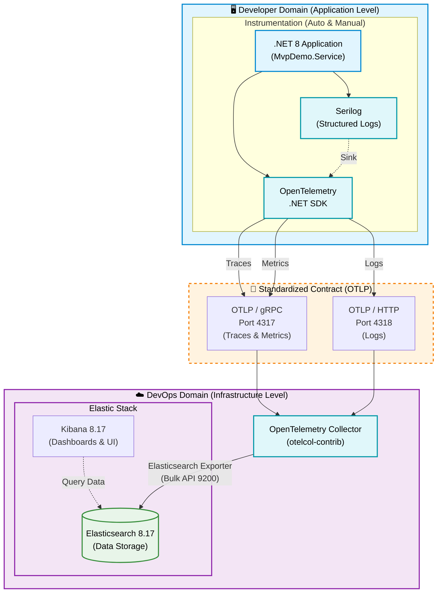

# Kiến Trúc Observability: Phân Tách Giữa Dev và DevOps

Dưới đây là mô hình kiến trúc High-Level đã được chuẩn hóa. Mô hình này giúp phân định rõ ràng ranh giới trách nhiệm, giao thức giao tiếp giữa team Development (Dev) và team Operations/Platform (DevOps), đảm bảo cả 2 bên có thể làm việc độc lập mà không gây ảnh hưởng lẫn nhau.

## 1. Sơ đồ Kiến trúc (High-Level Architecture)

## 2. Phân Chia Trách Nhiệm (Responsibilities)

Việc áp dụng chuẩn này mang lại một bản "Hợp đồng" rõ ràng giữa 2 team:

### 🛠️ Trách nhiệm của Developer (Dev)
* **Phạm vi**: Chỉ quản lý Code trong ứng dụng.
* **Nhiệm vụ**:
  * Implement và cấu hình `OpenTelemetry SDK` và `Serilog`.
  * Viết code tuân thủ các chuẩn semantic (ví dụ: gắn đúng các attributes vào Activity/Span, log có đầy đủ PII masking).
  * Khai báo endpoint trỏ về OTel Collector qua biến môi trường (ví dụ: `Otel__OtlpEndpoint`).
* **Không cần quan tâm**: Dữ liệu lưu ở đâu? Index name là gì? Kibana cấu hình ra sao? Database backend đang dùng là gì?

### ⚙️ Trách nhiệm của DevOps / SRE
* **Phạm vi**: Quản lý Data Pipeline và Backend Storage.
* **Nhiệm vụ**:
  * Triển khai và vận hành `OpenTelemetry Collector`.
  * Cấu hình các rules xử lý data: batching, memory limiting, filter data dư thừa.
  * Lựa chọn, vận hành và scale hệ thống backend (ở đây là Elasticsearch + Kibana).
* **Không cần quan tâm**: Code .NET viết kiểu gì? Thư viện Serilog dùng version mấy? App chạy kịch bản ra sao? 

## 3. Tại sao chọn OTLP làm Giao thức Chuẩn Hóa (Standard Contract)?

Đường đứt nét màu cam ở giữa chính là điểm sáng nhất của kiến trúc này: **OpenTelemetry Protocol (OTLP)**.

> [!TIP]
> **Zero Vendor Lock-in**
>
> Bằng cách sử dụng OTLP làm chuẩn giao tiếp ở giữa, cả Dev và DevOps đều được "giải phóng":
> 1. **Nếu Dev muốn đổi ngôn ngữ:** Từ .NET sang Java hay Go, họ chỉ cần dùng SDK của ngôn ngữ đó bắn ra chuẩn OTLP. DevOps không cần cài đặt agent rườm rà.
> 2. **Nếu DevOps muốn đổi Backend:** Giả sử công ty không muốn dùng Elasticsearch nữa mà chuyển sang Datadog, Grafana, hay Splunk. Dev **KHÔNG CẦN sửa một dòng code nào**. DevOps chỉ cần sửa cấu hình ở `OpenTelemetry Collector` để trỏ Exporter sang đích mới.

## 4. Công Cụ Đề Xuất (Tooling Standard)
Dựa trên kiến trúc trên, bộ công cụ chuẩn cho dự án được chốt lại như sau:
- **Ngôn ngữ/Framework**: .NET 8 (C#)
- **Log framework**: Serilog
- **Tracing/Metrics SDK**: OpenTelemetry .NET
- **Chuẩn Giao Tiếp**: OTLP (gRPC trên cổng 4317, HTTP trên cổng 4318)
- **Data Pipeline/Proxy**: OpenTelemetry Collector (bản `contrib` để có sẵn nhiều Exporter)
- **Lưu Trữ (Storage)**: Elasticsearch 8.x
- **Hiển Thị (Visualization)**: Kibana 8.x
